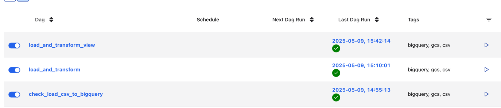
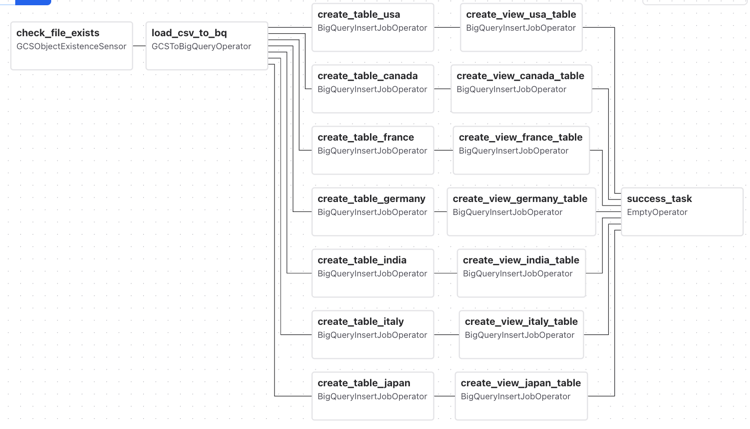
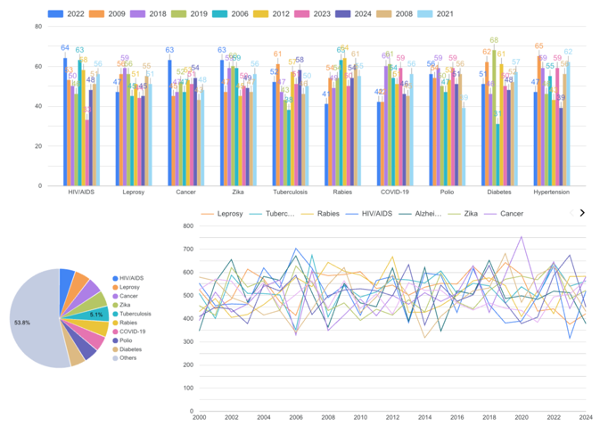
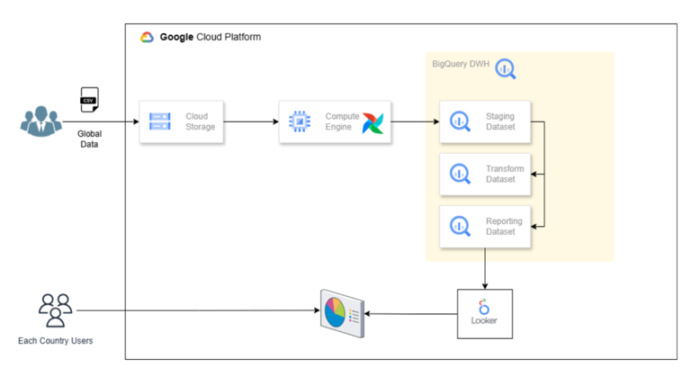

# gcp_projects

### How to set up airflow?

#### Environment build up
The VM instance should be created in GCP. Once it has been create, we can set up the environment for airflow.
The environment build-up could be followed below:
```
sudo apt install python3 python3-pip python3-venv

python -m venv ~/airflow-env
source airflow-env/bin/activate

pip3 install apache-airflow[gcp]
```

#### How to start airflow?
```airflow standalone ```, then u can use the external IP of VM with the port 8080. --> after u kill this terminal, airflow will not work any more
In order to run it all the time, ```nohup airflow standalone > airflow.log```

By running this ```cat /home/calvinlismmm/airflow/simple_auth_manager_passwords.json.generated```, the username and password of airflow can be seen.

Then, creating a folder for dags: ```mkdir dag```, you can put the dag file under this file. 
You can see the dag in the UI.



#### ELT pipeline in airflow

Below is the pipeline graph:




### Presentation by using LookerStudio

Connect LookerStudio to bigquery, then the data can be visualized by using diverse plots. Below is the visualization of Japan health data.




## The workflow of this project

This project utilizes airflow, GCP(big query, storage and VM instances), LookerStudio



### Workflow description
Extract: Check for file existence in GCS.
Load: Load raw CSV data into a BigQuery staging table.
Transform:
Create country-specific tables in the transform layer.
Generate reporting views for each country with filtered insights.

### Data Layers
Staging Layer: Raw data from the CSV file.
Transform Layer: Cleaned and transformed tables.
Reporting Layer: Views optimized for analysis and reporting.


